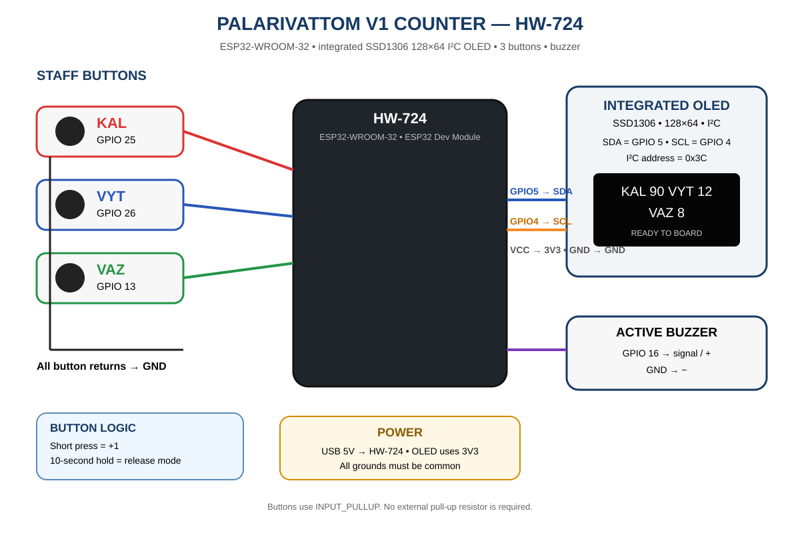

# JSPL Palarivattom V1 — Staff Availability Counter

This firmware is the first real hardware prototype for the Palarivattom showroom exit counter.

It runs **completely on one ESP32**. The ESP32 hosts the web server and can create its own Wi-Fi access point. The counter itself does not depend on a cloud server.

## Circuit diagram



Full-size diagram: `docs/hardware/circuit-diagram.svg`

## What this version does

Three hostel/destination buttons:

- **KAL** = Kaloor
- **VYT** = Vytilla
- **VAZ** = Vazhakala

### Normal mode

- Short press a hostel button → ready/waiting count **+1**.
- Hold a hostel button for **10 seconds** → enter release mode for that hostel.
- The 10-second action has a live OLED progress bar.

### Release mode

The selected hostel button now represents staff physically exiting the showroom.

- Short press → **Exited +1**.
- The waiting count is deliberately frozen while the group is being released.
- Hold for 10 seconds → confirm the physical exit count.
- Hold for another 10 seconds → confirm reduction of the waiting queue.
- The final action performs `waiting = waiting - exited` and returns to normal mode.

Example:

```text
KAL waiting = 90

Release mode
27 staff physically exit

Confirm

KAL waiting = 63
```

The bus controller is **not part of V1**. This device is only a reliable three-channel counter for staff available to board.

## OLED UI

The display is a **128x64 monochrome OLED**. The normal screen uses the display as efficiently as possible:

```text
PVM-GATE-01                         *

 KAL          VYT          VAZ
  90           12            8

          READY TO BOARD
```

During release mode it switches to a focused screen showing waiting and exited counts. During every 10-second hold it shows a filling progress bar and elapsed time.

## Hardware

- ESP32 DevKit V1 / compatible classic ESP32
- 128x64 SSD1306 **SPI** OLED
- 3 momentary push buttons
- Optional buzzer

### Pinout

The current hardware configuration is in `src/config.h`.

| Function | GPIO |
|---|---:|
| KAL button | 25 |
| VYT button | 26 |
| VAZ button | 27 |
| Buzzer | 32 |
| OLED SCK | 18 |
| OLED MOSI | 23 |
| OLED CS | 5 |
| OLED DC | 16 |
| OLED RST | 17 |

OLED power:

- VCC → 3.3V
- GND → GND

Buttons use `INPUT_PULLUP`:

- One side → GPIO
- Other side → GND

### Important

The pin map assumes a **classic ESP32 DevKit / ESP32-WROOM style board** and an SPI SSD1306 module. If your ESP32 or OLED uses different pins/interface, change only `src/config.h`.

## Local web server

The ESP32 creates a temporary local Wi-Fi access point:

- SSID: `JSPL-PVM-GATE`
- Password: `jsplgate1`
- Dashboard: `http://192.168.4.1`
- Settings: `http://192.168.4.1/settings`
- Network & OTA: `http://192.168.4.1/network`

The dashboard is a live monitor of the physical counter. Physical buttons remain the primary operational controls for V1.

## Self-hosted device settings

The ESP32 has its own configuration page. No computer or external server is required.

The settings page supports:

### Device

- Device ID
- Device name
- Showroom
- Installation point

### Bus preparation

The bus controller is not active in V1, but the reusable device configuration already supports:

- Vehicle registration number
- Bus capacity
- Bus enabled/disabled

The final project will use the **vehicle registration number as the bus identifier**.

### Destinations

Each of the three physical buttons can be configured without recompiling the firmware:

- Button 1 code/name
- Button 2 code/name
- Button 3 code/name

Default configuration:

```text
Button 1 → KAL / Kaloor
Button 2 → VYT / Vytilla
Button 3 → VAZ / Vazhakala
```

### Operation

The following parameters are stored in the ESP32:

- Long-press duration — default 10,000 ms
- Button debounce — default 35 ms
- OLED message duration — default 1,800 ms

### Network

Open:

```text
http://192.168.4.1/network
```

Enter the showroom Internet Wi-Fi credentials. The credentials are stored in ESP32 NVS and are not part of the GitHub source code.

The ESP32 keeps its local access point while also using the configured Wi-Fi as a station, so it can reach GitHub for OTA updates.

### Security

Settings and OTA actions require the local administrator PIN.

Default development PIN:

```text
1234
```

**Change this before operational deployment.**

The configuration is stored in ESP32 NVS using `Preferences`, so it survives a normal reboot.

## Automatic OTA updates

The device checks for a newer GitHub Release **after every boot** when Internet Wi-Fi is configured.

Update flow:

```text
ESP32 boots
   ↓
Start local counter
   ↓
Connect to configured Internet Wi-Fi
   ↓
Check latest GitHub Release
   ↓
Same version → continue normally
   ↓
New version → download firmware.bin
   ↓
Write inactive OTA partition
   ↓
Validate firmware
   ↓
Reboot
   ↓
Run new firmware
```

The OTA partition table provides two application slots (`ota_0` and `ota_1`) plus the OTA data partition. This is the safe ESP32 OTA architecture: the new image is written to the inactive application slot rather than overwriting the running firmware. See Espressif's OTA documentation for the underlying mechanism. 

The device also exposes **CHECK FOR UPDATE NOW** at `/network`.

### GitHub Release format

A release is expected to contain:

```text
firmware.bin
version.txt
```

The updater uses the stable GitHub latest-release download paths:

```text
/releases/latest/download/firmware.bin
/releases/latest/download/version.txt
```

### Automated releases

`.github/workflows/esp32-release.yml` builds the PlatformIO firmware and creates the GitHub Release when a tag such as:

```text
v1.0.1
```

is pushed.

The workflow publishes the firmware binary and the matching version file. PlatformIO supports GitHub Actions as a CI/build workflow for PlatformIO projects. 

### Important security note

The current prototype uses TLS transport with certificate verification disabled (`setInsecure()`) so we can get the Palarivattom pilot working without embedding certificate material.

**Before production deployment across JSPL showrooms, certificate verification and signed firmware verification should be enabled.**

## Configuration architecture

Hardware-specific values remain in `src/config.h`:

```text
GPIO pins
OLED pins
buzzer pin
screen dimensions
```

Operational/device values are stored in NVS and can be changed from the device web interface:

```text
Device name
Showroom
Installation
Bus registration
Bus capacity
Destinations
Long-press duration
Debounce
Message duration
Wi-Fi credentials
Admin PIN
```

This allows the same firmware to be deployed at different JSPL showrooms without creating a separate firmware build for each location.

## Persistent counter storage

Counts are stored using ESP32 `Preferences` (NVS), so waiting counts survive a normal reboot/power cycle.

Factory reset from the settings page resets **configuration only**. It does not silently erase the staff counters.

## Build

Open `firmware/esp32-minimal` in PlatformIO and upload to an ESP32 DevKit.

Then:

1. Open Serial Monitor at 115200 baud.
2. Connect a phone to `JSPL-PVM-GATE`.
3. Open `http://192.168.4.1`.
4. Open `/settings` to configure the device.
5. Open `/network` and enter the Internet Wi-Fi credentials.
6. Change the administrator PIN.
7. Test the three physical buttons.

## Current scope

This version intentionally does **not** include:

- Bus controllers
- Bus capacity enforcement
- Physical bus boarding counters
- Multi-trip management
- Cloud synchronization
- JSPL IoT integration as a transport application layer

The device can use the showroom Internet Wi-Fi only for OTA in this stage. Transport logic remains local to the ESP32.

## References

- Espressif OTA architecture: https://docs.espressif.com/projects/esp-idf/en/stable/esp32/api-reference/system/ota.html
- PlatformIO GitHub Actions: https://docs.platformio.org/en/stable/integration/ci/github-actions.html
